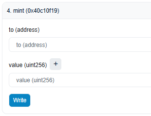

# Testing

To test the Request Finance API with your application, you can use your “Test†API key when making requests. You can find your “Test†API key in the ["Developer" tab](https://app.request.finance/account/api-keys) in “Settings”. 

Invoices that you create using your “Test†API key will be persisted on the Sepolia Testnet (a testing network for Ethereum). You can see and interact with them in our sandbox: [https://baguette-app.request.finance/](https://baguette-app.request.finance/). Use your existing credentials to access your sandbox account. 


API keys are not recommended for a live application and will be deprecated. Follow the steps in [going-live.md](going-live.md "mention") instead. 


## Payments

To test paying an invoice or a payroll payment without spending real tokens, you can use ETH on Sepolia Testnet. You can get some using a faucet online and your wallet address. 

Make sure to create invoices and payroll payments with ETH on Sepolia as a payment method. 

Since the account that issued the invoice cannot be the account that pays the invoice, you will need to create another Request Finance account for the buyer role.

#### **Test ERC20 tokens** 

To test stablecoin payments on Sepolia, we use `FAU` as a `DAI`-pegged testnet token. You can mint some `FAU` tokens by calling use the `mint` function of the `FAU` smart contract:

* Open the `FAU` contract on Etherscan page: [https://sepolia.etherscan.io/address/0x370de27fdb7d1ff1e1baa7d11c5820a324cf623c#writeContract](https://sepolia.etherscan.io/address/0x370de27fdb7d1ff1e1baa7d11c5820a324cf623c#writeContract)
* Click on `Connect to Web3` and pick Metamask
* Metamask will ask you to connect and confirm
* Open the `4. Mint` section

<figure><figcaption>
<code>mint</code> function of the <code>FAU</code> smart-contract
</figcaption></figure>

* Fill up the `to (address)` field with the address of your wallet (you can find it on top of your Metamask window)
* Insert `10000000000000000000000` for the `value (uint256)`. This is equivalent to `10000 FAU` (with 18 decimals after that).
* Click `Write`, confirm the transaction in Metamask

💡 If you don’t see your `FAU` on Metamask:

* Click on “Don’t see your token? Import tokens”
* Click on “Add custom token” and paste `FAU` contract address: `0x370de27fdb7d1ff1e1baa7d11c5820a324cf623c`&#x20;

## Postman Collection

You can find a Postman collection of the Request Finance API [here](https://www.postman.com/request-finance/workspace/request-finance-api-public/documentation/24913360-b5105a65-a6bd-4247-b3b1-ed60e5c8f5cb). Feel free to use it to test the API.&#x20;

\
